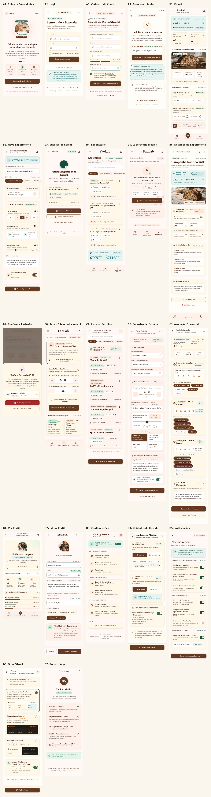
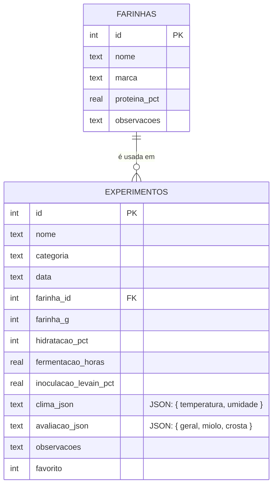

# PaoLab

## Sobre o app

O **PaoLab** é um aplicativo mobile voltado para padeiros artesanais que praticam panificação com fermentação natural (sourdough) e outras técnicas artesanais. O objetivo é servir como um "diário de bordo" digital para cada fornada, permitindo registrar as condições de produção, acompanhar o clima do ambiente (que afeta diretamente a fermentação) e avaliar os resultados de cada receita ao longo do tempo — tudo funcionando offline, já que o padeiro nem sempre está com internet disponível na cozinha ou na padaria.

Com o PaoLab, o usuário consegue comparar fornadas diferentes, identificar padrões (por exemplo, se uma hidratação mais alta em dias mais quentes rendeu um miolo melhor) e evoluir suas receitas com base em dados reais, em vez de depender só da memória ou de anotações soltas em papel.

### Funcionalidades básicas (prioritárias)

- [x] Cadastro de um novo experimento/fornada (nome, categoria de pão, farinha, hidratação, tempo de fermentação, inoculação de levain)
- [x] Validação de hidratação dentro de uma faixa realista (50% a 100%)
- [x] Armazenamento local dos experimentos via SQLite (funciona offline)
- [x] Listagem do histórico de experimentos (Laboratório)
- [x] Marcar/desmarcar experimentos como favoritos
- [x] Painel com estatísticas gerais (total de fornadas, nota média)
- [x] Captura automática do clima atual (temperatura e umidade) via Open-Meteo
- [ ] Avaliação sensorial detalhada por experimento (miolo, crosta, geral) com formulário próprio
- [ ] Edição e exclusão de experimentos já cadastrados
- [ ] Cadastro e seleção de farinhas específicas (marca, % de proteína) por experimento

### Funcionalidades adicionais (trabalhos futuros)

- [ ] Cálculo automático de sugestão de hidratação com base no clima do dia
- [ ] Gráficos de evolução (nota média ao longo do tempo, por categoria de pão)
- [ ] Fotos anexadas a cada experimento (registro visual do miolo/crosta)
- [ ] Exportação do histórico (PDF ou CSV) para compartilhar receitas
- [ ] Modo comparação entre dois experimentos lado a lado
- [ ] Notificações/lembretes de etapas da fermentação (ex: hora de dobrar a massa)

## Protótipos de tela

Os protótipos foram desenhados com o [Google Stitch](https://stitch.withgoogle.com/), seguindo a paleta e tipografia definidas no design system do app (tons terrosos, tipografia serifada para títulos). Abaixo está o mapa com as 8 telas principais, cobrindo o fluxo completo de uso e os estados alternativos (vazio, sucesso, erro e confirmação):

1. **Painel** — visão geral com clima da bancada, estatísticas e experimento favorito
2. **Novo Experimento** — formulário de cadastro de uma nova fornada
3. **Sucesso ao Salvar** — feedback de confirmação após o cadastro
4. **Laboratório** — histórico de experimentos com busca e filtros
5. **Laboratório (vazio)** — estado inicial, antes do primeiro cadastro
6. **Detalhes do Experimento** — ficha técnica completa de uma fornada específica
7. **Confirmar Exclusão** — diálogo de confirmação antes de apagar um registro
8. **Aviso: Clima Indisponível** — estado de erro quando o sensor de clima falha

## Modelagem do banco

O banco é **local**, implementado com **SQLite** através da biblioteca `expo-sqlite`, já que o app precisa funcionar offline (o padeiro registra fornadas na cozinha, nem sempre com internet disponível). Não há backend remoto nem sincronização em nuvem nesta fase do projeto.

O banco tem duas tabelas relacionais (`farinhas` e `experimentos`). Os dados de **clima** e de **avaliação sensorial** são armazenados como colunas `TEXT` em formato JSON dentro da própria tabela `experimentos`, em vez de tabelas separadas — a decisão foi por simplicidade, já que cada experimento tem exatamente um registro de clima e uma avaliação (relação 1:1), sem necessidade de consultas ou filtros por esses campos isoladamente.

### Evolução planejada

Conforme o app cresce (ver checklist e sprints abaixo), duas mudanças de modelagem estão previstas:

- Extrair `avaliacao_json` para uma tabela própria `avaliacoes` (1:1 com `experimentos`), quando a tela de avaliação sensorial detalhada for implementada — facilita consultas como "experimentos com nota de miolo acima de 4".
- Permitir múltiplas farinhas por experimento (blends), o que exigiria uma tabela associativa `experimento_farinhas` (N:N) no lugar da FK simples `farinha_id`.

## Planejamento de sprints

Cronograma estimado a partir deste Checkpoint 1, em sprints semanais. As prioridades seguem a checklist de "Funcionalidades básicas" acima; as funcionalidades adicionais só entram depois que o MVP estiver fechado e alinhado aos protótipos.

| Sprint | Semana(s)   | Entregas                                                                                                                                              |
| ------ | ----------- | ----------------------------------------------------------------------------------------------------------------------------------------------------- |
| 1      | Semana 1    | Avaliação sensorial detalhada (tela própria, notas de geral/miolo/crosta) + migração de `avaliacao_json` para tabela `avaliacoes`                     |
| 2      | Semana 2    | CRUD completo: edição e exclusão de experimentos (telas "Detalhes do Experimento" e "Confirmar Exclusão" já prototipadas)                             |
| 3      | Semana 3    | Cadastro e seleção de farinhas (marca, % de proteína) e uso no formulário de novo experimento                                                         |
| 4      | Semanas 4–5 | Redesign da UI para alinhar com os protótipos do Stitch (Painel, Novo Experimento, Laboratório) — maior sprint por envolver todas as telas principais |
| 5      | Semana 6    | Estados de borda: laboratório vazio, aviso de clima indisponível, tratamento de erros e mensagens de feedback                                         |
| 6      | Semana 7    | Uma funcionalidade adicional (a definir entre sugestão automática de hidratação por clima ou gráficos de evolução)                                    |
| 7      | Semana 8    | Testes manuais em dispositivo real/emulador, correções de bugs, revisão final do README e da documentação                                             |

> Cronograma sujeito a ajuste conforme o andamento real do semestre; será revisado a cada checkpoint da disciplina.
