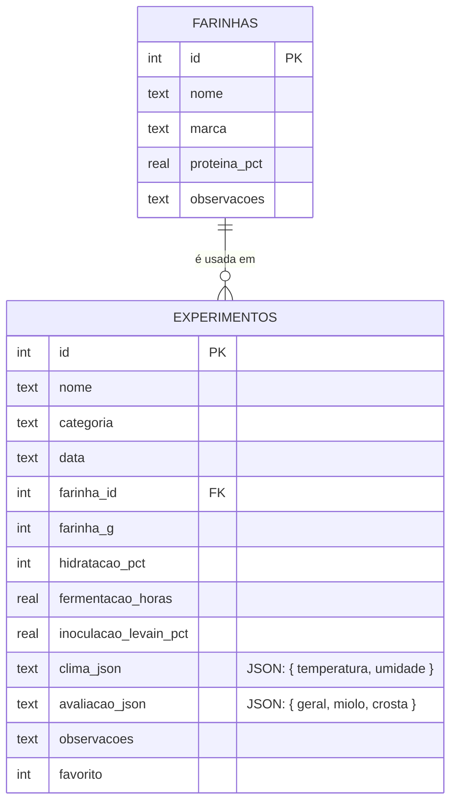

# PaoLab Mobile

> Diário pessoal e laboratório de panificação — a versão mobile (Android/iOS) do PaoLab, feita com React Native e Expo, com foco em uma experiência **offline-first** para uso direto na cozinha durante o preparo dos pães.

## Sobre o app

O **PaoLab** é um aplicativo mobile voltado para padeiros artesanais que praticam panificação com fermentação natural (sourdough) e outras técnicas artesanais. O objetivo é servir como um "diário de bordo" digital para cada fornada, permitindo registrar as condições de produção, acompanhar o clima do ambiente (que afeta diretamente a fermentação) e avaliar os resultados de cada receita ao longo do tempo — tudo funcionando offline, já que o padeiro nem sempre está com internet disponível na cozinha ou na padaria.

Com o PaoLab, o usuário consegue comparar fornadas diferentes, identificar padrões (por exemplo, se uma hidratação mais alta em dias mais quentes rendeu um miolo melhor) e evoluir suas receitas com base em dados reais, em vez de depender só da memória ou de anotações soltas em papel.

### Funcionalidades básicas (prioritárias)

- [x] Cadastro de um novo experimento/fornada (nome, categoria de pão, farinha, hidratação, tempo de fermentação, inoculação de levain)
- [x] Validação de hidratação dentro de uma faixa realista (50% a 100%)
- [x] Armazenamento local dos experimentos via SQLite (funciona offline)
- [x] Listagem do histórico de experimentos (Laboratório)
- [x] Marcar/desmarcar experimentos como favoritos
- [x] Painel com estatísticas gerais (total de fornadas, nota média)
- [x] Captura automática do clima atual (temperatura e umidade) via Open-Meteo
- [ ] Avaliação sensorial detalhada por experimento (miolo, crosta, geral) com formulário próprio
- [ ] Edição e exclusão de experimentos já cadastrados
- [ ] Cadastro e seleção de farinhas específicas (marca, % de proteína) por experimento

### Funcionalidades adicionais (trabalhos futuros)

- [ ] Conta de usuário (login, cadastro, recuperação de senha)
- [ ] Perfil do usuário (visualizar e editar)
- [ ] Tela de Configurações (unidades de medida, notificações, tema visual, sobre o app)
- [ ] Cálculo automático de sugestão de hidratação com base no clima do dia
- [ ] Gráficos de evolução (nota média ao longo do tempo, por categoria de pão)
- [ ] Fotos anexadas a cada experimento (registro visual do miolo/crosta)
- [ ] Exportação do histórico (PDF ou CSV) para compartilhar receitas
- [ ] Modo comparação entre dois experimentos lado a lado
- [ ] Notificações/lembretes de etapas da fermentação (ex: hora de dobrar a massa)

## Protótipos de tela

Os protótipos foram feitos em conjunto no **Figma** e no **Google Stitch**: o Stitch foi usado para gerar rapidamente as variações de tela em cima do design system próprio ("Tactile Editorial Craft" — paleta em tons terrosos, tipografia serifada Fraunces para títulos e monoespaçada Jetbrains Mono para medições técnicas), e o Figma para organizar, refinar e publicar o protótipo final.

Veja os protótipos interativos nos links abaixo, ou o mapa estático com todas as telas logo a seguir (útil caso os links não estejam acessíveis):

- **Figma:** https://www.figma.com/design/cpvoitQcVrBi2hYD4pNeCO/pao-lab-moblie?node-id=0-1&t=B25dZncB7XvBx49H-1
- **Stitch (com interação entre as telas):** https://stitch.withgoogle.com/projects/12962388773360608146

**Bloco A — Autenticação**

1. Splash / Boas-vindas — onboarding explicando o app na primeira abertura
2. Login
3. Cadastro de Conta
4. Recuperar Senha

**Bloco B — Fluxo principal**

5. Painel — visão geral com clima da bancada, estatísticas e experimento favorito
6. Novo Experimento — formulário de cadastro de uma nova fornada
7. Sucesso ao Salvar — feedback de confirmação após o cadastro
8. Laboratório — histórico de experimentos com busca e filtros
9. Laboratório (vazio) — estado inicial, antes do primeiro cadastro
10. Detalhes do Experimento — ficha técnica completa de uma fornada específica
11. Confirmar Exclusão — diálogo de confirmação antes de apagar um registro
12. Aviso: Clima Indisponível — estado de erro quando o sensor de clima falha

**Bloco C — Farinhas e avaliação sensorial**

13. Lista de Farinhas
14. Cadastro de Farinha
15. Avaliação Sensorial detalhada (notas de geral, miolo e crosta)

**Bloco D — Perfil e configurações**

16. Ver Perfil
17. Editar Perfil
18. Configurações
19. Unidades de Medida
20. Notificações
21. Tema Visual
22. Sobre o App

## Modelagem do banco

O banco é **local**, implementado com **SQLite** através da biblioteca `expo-sqlite`, já que o app precisa funcionar offline (o padeiro registra fornadas na cozinha, nem sempre com internet disponível). Não há backend remoto nem sincronização em nuvem nesta fase do projeto.

O banco tem duas tabelas relacionais (`farinhas` e `experimentos`). Os dados de **clima** e de **avaliação sensorial** são armazenados como colunas `TEXT` em formato JSON dentro da própria tabela `experimentos`, em vez de tabelas separadas — a decisão foi por simplicidade, já que cada experimento tem exatamente um registro de clima e uma avaliação (relação 1:1), sem necessidade de consultas ou filtros por esses campos isoladamente.

### Evolução planejada

Conforme o app cresce (ver checklist e sprints abaixo), duas mudanças de modelagem estão previstas:

- Extrair `avaliacao_json` para uma tabela própria `avaliacoes` (1:1 com `experimentos`), quando a tela de avaliação sensorial detalhada for implementada — facilita consultas como "experimentos com nota de miolo acima de 4".
- Permitir múltiplas farinhas por experimento (blends), o que exigiria uma tabela associativa `experimento_farinhas` (N:N) no lugar da FK simples `farinha_id`.

## Planejamento de sprints

Cronograma estimado a partir deste Checkpoint 1, em sprints semanais. As prioridades seguem a checklist de "Funcionalidades básicas" acima; as funcionalidades adicionais só entram depois que o MVP estiver fechado e alinhado aos protótipos.

| Sprint | Semana(s)    | Entregas                                                                                                                                             | Status       |
| ------ | ------------ | ---------------------------------------------------------------------------------------------------------------------------------------------------- | ------------ |
| CP1    | Semana atual | Documentação: README, protótipos, modelagem do banco e este cronograma                                                                               | ✅ Concluído |
| 1      | Semana 1     | Avaliação sensorial detalhada (tela própria, notas de geral/miolo/crosta) + migração de `avaliacao_json` para tabela `avaliacoes`                    | ⏳ Planejado |
| 2      | Semana 2     | CRUD completo: edição e exclusão de experimentos (telas "Detalhes do Experimento" e "Confirmar Exclusão" já prototipadas)                            | ⏳ Planejado |
| 3      | Semana 3     | Cadastro e seleção de farinhas (marca, % de proteína) e uso no formulário de novo experimento                                                        | ⏳ Planejado |
| 4      | Semanas 4–5  | Redesign da UI para alinhar com os protótipos do Figma (Painel, Novo Experimento, Laboratório) — maior sprint por envolver todas as telas principais | ⏳ Planejado |
| 5      | Semana 6     | Estados de borda: laboratório vazio, aviso de clima indisponível, tratamento de erros e mensagens de feedback                                        | ⏳ Planejado |
| 6      | Semana 7     | Uma funcionalidade adicional (a definir entre sugestão automática de hidratação por clima ou gráficos de evolução)                                   | ⏳ Planejado |
| 7      | Semana 8     | Testes manuais em dispositivo real/emulador, correções de bugs, revisão final do README e da documentação                                            | ⏳ Planejado |

> Cronograma sujeito a ajuste conforme o andamento real do semestre; será revisado a cada checkpoint da disciplina.
